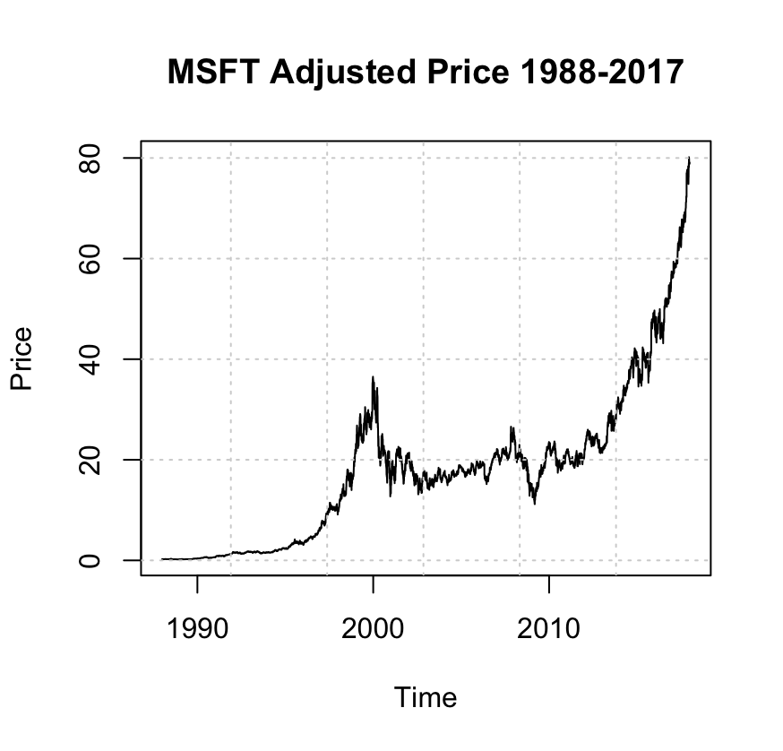
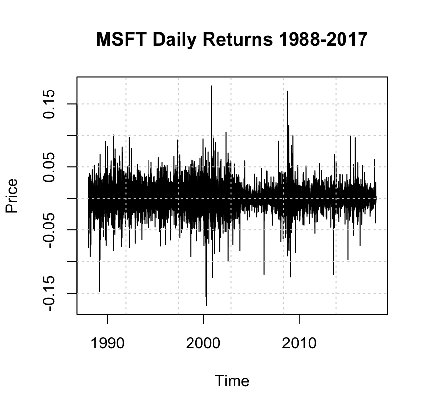
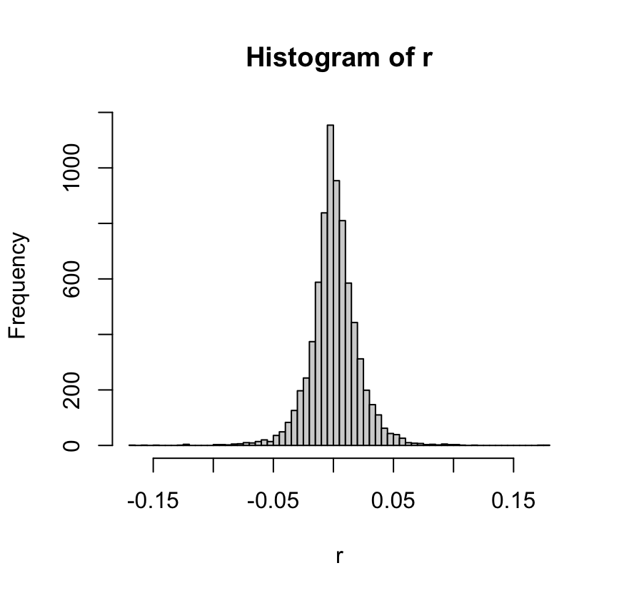
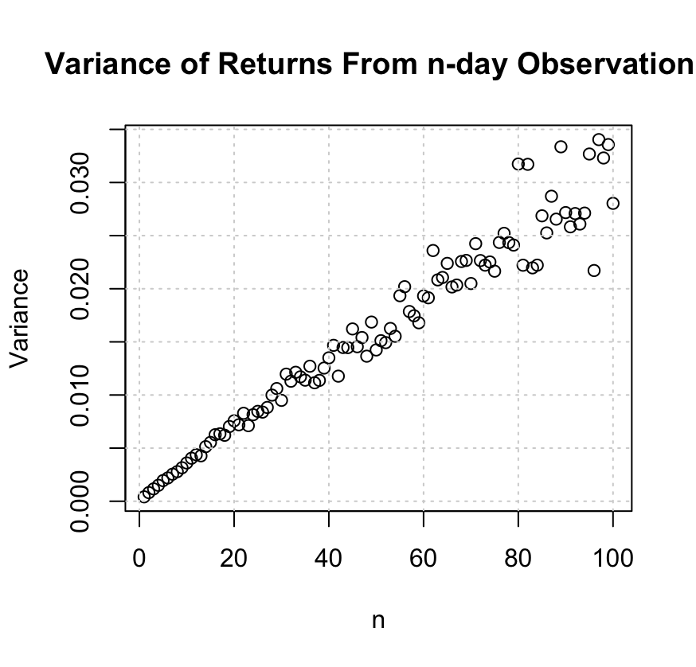
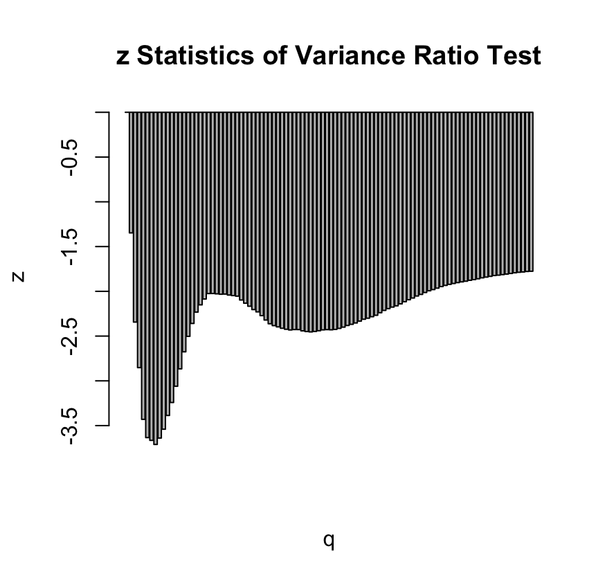
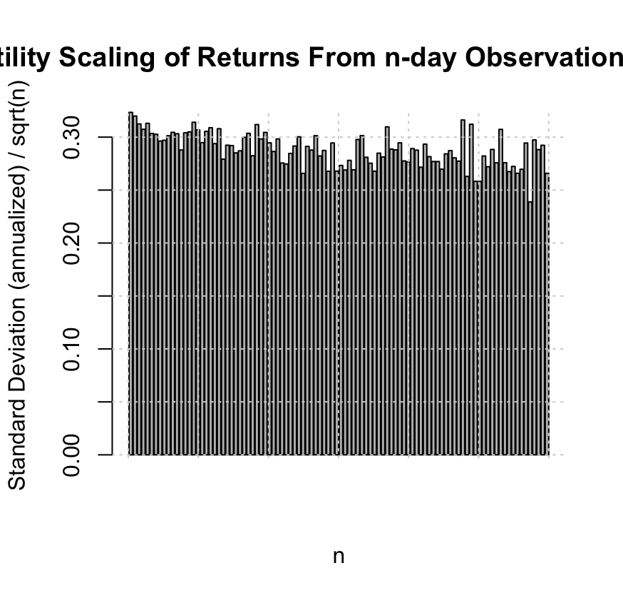
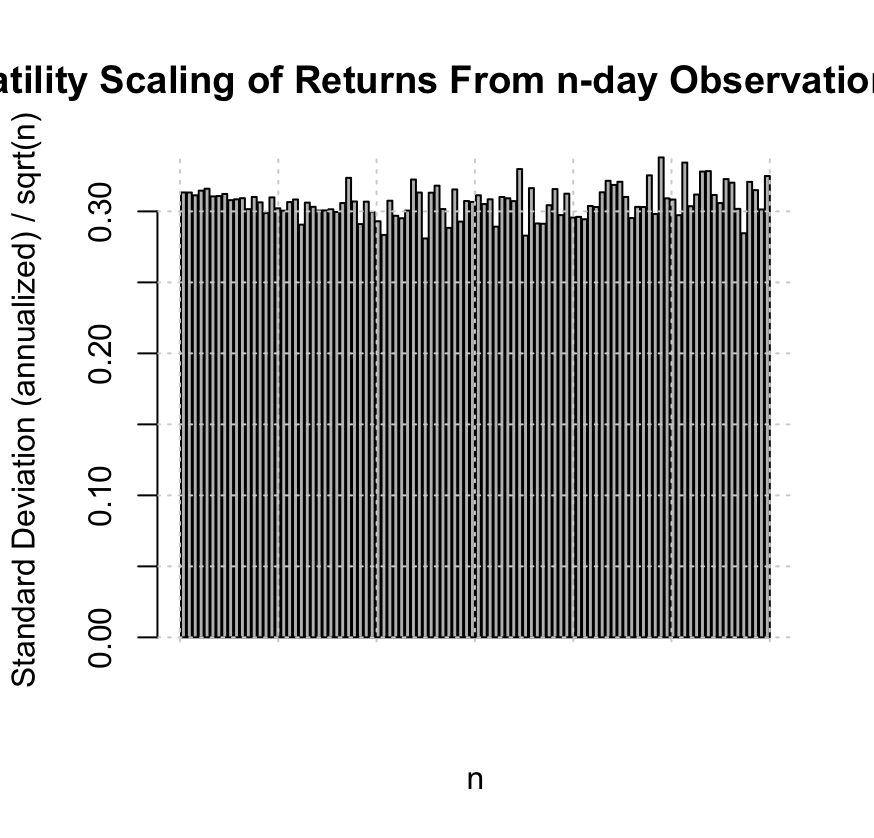

# Random Walk Analysis of MSFT (1988–2017)

## 1) Objective
The aim of this analysis is to determine whether Microsoft’s daily **adjusted prices** (1988–2017) are consistent with a **Random Walk** (RW) process.

In a RW, **log-returns** behave like independent, unpredictable shocks. Past information should not help predict future returns, which aligns with the **Weak-Form Efficient Market Hypothesis**.

**Research question:** Are MSFT daily log-returns independent and uncorrelated, so that the scaling of variance and volatility with time matches RW theory?

---

## 2) Theoretical background

### 2.1 Random Walk in log-prices
Adjusted prices are modeled as:

$$\log P_t = \log P_{t-1} + r_t$$

where:
- $$P_t$$ = adjusted closing price at time $$t$$
- $$r_t$$ = daily **logarithmic return**:

$$
r_t = \log P_t - \log P_{t-1}
$$

---

### 2.2 Expected properties under a Random Walk
If $$r_t$$ are independent and identically distributed (IID):

1. **Variance grows linearly with the horizon $$q$$**:

$$\mathrm{Var}(r^{(q)}) = q \cdot \mathrm{Var}(r^{(1)})$$

2. **Volatility scales with the square root of time**:

$$\sigma(q) \approx \frac{\sigma(1)}{\sqrt{q}}$$

3. **Variance Ratio**:

$$VR(q) = \frac{\mathrm{Var}(r^{(q)})}{q \cdot \mathrm{Var}(r^{(1)})}$$

Under RW: $$VR(q) = 1$$ for all $$q$$.

---

### 2.3 Lo & MacKinlay Variance Ratio Test
Lo & MacKinlay (1988) developed the VR test to evaluate:

- **Null hypothesis** $$H_0$$: $$VR(q) = 1$$ (Random Walk)
- **Alternative**: $$VR(q) \neq 1$$ (autocorrelation present)

Test statistic:

$$z(q) = \frac{VR(q) - 1}{\mathrm{StdError}(VR(q))}$$

If $$|z(q)| > 1.96$$, we reject the RW hypothesis for that $$q$$ at the 5% level.

---

## 3) Methodology and Results

### 3.1 Adjusted Price Series
  
The adjusted price series for MSFT from 1988 to 2017 shows a long-term upward trend and non-stationary behavior, typical for asset prices. A RW allows for such trends, but the predictability lies in returns, not prices.

---

### 3.2 Daily Log-Returns
  
Daily log-returns appear stationary (no clear trend) and centered around zero, but volatility clustering is visible — periods of high volatility are grouped together. This is common in financial time series.

---

### 3.3 Comparison to White Noise
  
A simulated white noise process with the same volatility as MSFT is plotted for comparison. White noise has constant variance and no clustering. Visual differences highlight volatility clustering in real returns.

---

### 3.4 Distribution of Returns
  
The histogram of returns is roughly bell-shaped but with heavier tails than a normal distribution, indicating higher probability of extreme returns compared to a Gaussian RW.

---

### 3.5 Variance vs Horizon $$q$$
  
For a RW, the variance of $$q$$-day returns should increase proportionally with $$q$$. MSFT shows approximate linearity, supporting the RW property, though small deviations appear at larger $$q$$.

---

### 3.6 Variance Ratio z-statistics
  
The VR test compares $$VR(q)$$ to 1. Most z-statistics lie within the ±1.96 band, meaning the RW hypothesis is not rejected for most horizons. A few horizons exceed this threshold, indicating mild autocorrelation.

---

### 3.7 Volatility Scaling (MSFT)
  
Annualized volatility of $$q$$-day returns is scaled by $$\sqrt{q}$$. Under RW, this should be flat across $$q$$. The MSFT plot is mostly flat, confirming the scaling law, with minor deviations at larger horizons.

---

### 3.8 Volatility Scaling (Monte Carlo Benchmark)
  
In a simulated RW with IID Gaussian returns, volatility scaling is perfectly flat, as theory predicts. This serves as a reference: deviations in the MSFT plot reflect real-world effects, not calculation errors.

---

## 4) Interpretation

- **Variance scaling**: Largely consistent with RW theory.  
- **VR test**: Mostly non-rejection of $$H_0$$, with occasional significant deviations indicating slight autocorrelation.  
- **Volatility scaling**: Nearly flat, with minor real-world deviations.  
- **Monte Carlo comparison**: Confirms the methodology matches theoretical expectations.

---

## 5) Conclusion

From 1988 to 2017, MSFT’s daily log-returns are **mostly consistent** with a Random Walk process:
- Weak evidence of predictability at some horizons.
- Scaling laws largely respected.
- Supports the Weak-Form EMH at the daily frequency.

Small deviations could be due to market microstructure effects, volatility clustering, or short-term autocorrelation.  
From a trading perspective, any predictability appears minimal and may not survive transaction costs.
